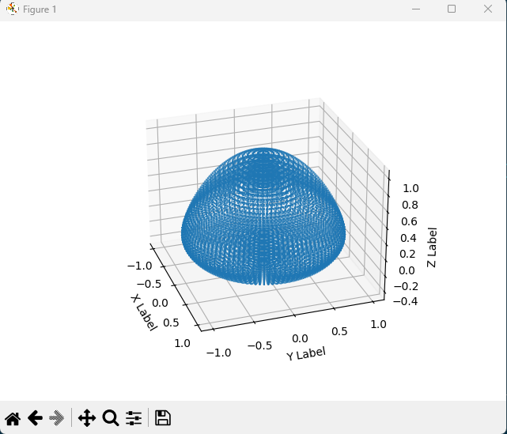
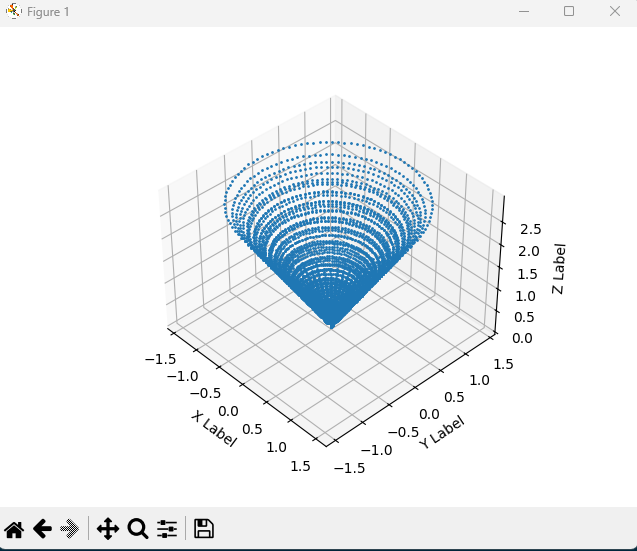

# Programa I

## Simulação de Divisão de Esfera 3D

Este projeto implementa uma simulação simples da divisão de uma esfera no espaço 3D. A simulação é realizada através da geração de pontos distribuídos uniformemente sobre a superfície de uma esfera, com um fator de compressão aplicado ao longo do eixo Z. Essa compressão simula uma transformação da esfera, como se ela estivesse sendo comprimida ou esticada ao longo desse eixo.

## Funcionalidades

- **Geração de Pontos na Esfera**: Calcula as coordenadas (x, y, z) de pontos sobre a superfície de uma esfera, utilizando a parametrização em coordenadas esféricas.
- **Simulação de Compressão**: Aplica um fator de compressão variável ao longo do eixo Z para simular a transformação da esfera.
- **Parametrização Flexível**: Permite a configuração do número de etapas da simulação, bem como o número de divisões na direção longitudinal (u) e latitudinal (v) da esfera.
- **Visualização dos Resultados**: Inclui um método para imprimir os pontos gerados, facilitando a visualização e análise dos resultados da simulação.

## Tecnologias Utilizadas

- Python: Utilizado para a implementação da simulação, aproveitando recursos como estruturas, vetores e funções matemáticas.

## Imagem

# Programa II

## Espiral

Este projeto implementa uma simulação de uma espiral 3D. A simulação é realizada através da geração de pontos distribuídos uniformemente sobre a superfície de uma espiral, com um fator de compressão aplicado ao longo do eixo Z. Essa compressão simula uma transformação da espiral, como se ela estivesse sendo comprimida ou esticada ao longo desse eixo.

